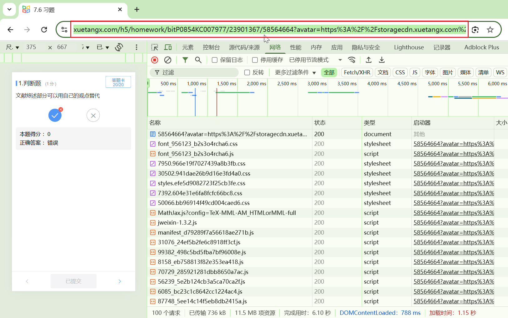

# XueTangxGetAnswer
 Python实现学堂在线答案爬取
-------------------------------------
#### 使用教程

##### 〇、准备工作

1. 完成所有作业，不要求正确率

##### 一、获取 cookie

1. 使用浏览器打开[学堂在线首页](https://www.xuetangx.com/)并登录

2. 登录成功后，按F12或者在学堂在线页面右键-检查  

3. 在弹出的DevTools窗口中选择网络(Network)，点击其正下方的红色按钮右边的清除按钮(可以不点，如果下方有内容则点了接下来比较方便查找)  


4. F5或者刷新本页面，在刚刚的网络(Network)窗口下方中找到名称(Name)，在下方找到 www.xuetangx.com 并点击，在右侧找到 key 为 cookie 对应的内容


5. 填写到 `main.py` 的 `COOKIE` 中

##### 二、获取课程信息

1. 在手机模式下，打开课程中任一作业页面

例：



2. 复制链接，填写到 `main.py` 的 `HOMEWORK_URL` 中

例：

```
https://www.xuetangx.com/h5/homework/bitP0854KC007977/23901367/58564584?avatar=https%3A%2F%2Fstoragecdn.xuetangx.com%2Fpublic_assets%2Fxuetangx%2Fimages%2Fb6ce32912ffa1c5959b0da6ceb9ce27e.avatar%402x.png&name=&user_number=null&term=latest&university_id=0&user_role=null&sessionid=null&csrftoken=undefined&xtbz=xt&django-language=zh
```

代码会自动提取 UID、CID、EID ，例如

```
UID: bitP0854KC007977
CID: 23901367
EID: 58564584
```

##### 三、运行

修改完 `main.py` 开头的 `COOKIE` `HOMEWORK_URL` 后，运行 `main.py`